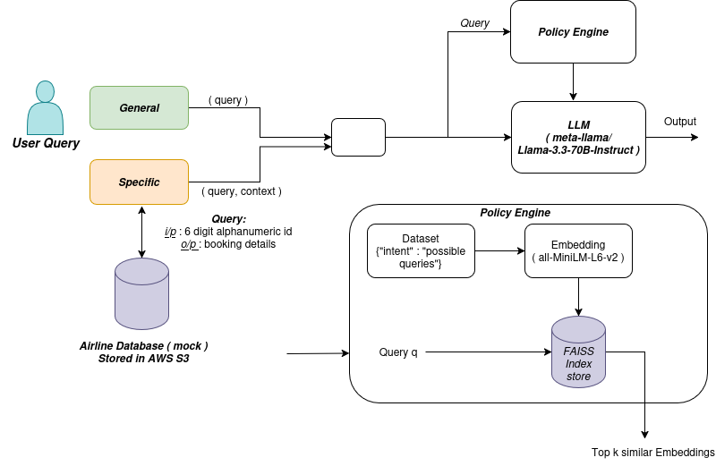

# Singapore_Airlines_Customer_Support_Chatbot

Production-oriented customer support chatbot for an airline. Uses a PEFT-fine-tuned Llama-3.3-70B model with retrieval-augmented generation. Retrieval uses a static FAISS vector store (≈300 vectors) built from documents stored in AWS S3. Model inference is hosted on Nebius AI Studio. All modules communicate via internal function calls and return free-text responses.

## Architecture




APPLICATION LINK : https://v0-singapore-airlines-assistant.vercel.app/

## Features

* Retrieval-augmented generation (RAG) with FAISS similarity search.
* Domain adaptation via PEFT fine-tuning of Llama-3.3-70B.
* Knowledge persistence in AWS S3.
* Managed inference on Nebius AI Studio.
* Lightweight, static index design for predictable behavior.


## Repository layout

```
.

├─ Data/
├─ Database/
├─ Scripts/
├─ airline-chatbot/
├─ intent_classifier/
├─ architecture.png
├─ documentation.pdf
└─ README.md
```


## Quick start (high level)

1. Provision AWS S3 bucket and upload the knowledge corpus (policies, FAQs, transcripts).
2. Configure Nebius AI Studio project and set inference endpoint for the fine-tuned model.
3. Build embeddings for the corpus using the `all-MiniLM-L6-v2` embedding model.
4. Create the FAISS index from embeddings and persist index files alongside the original documents (store index artifacts in S3 if desired).
5. Wire the Policy Engine to:

   * Turn incoming queries into embeddings.
   * Query FAISS for top-k contexts.
   * Assemble prompt with retrieved contexts and forward to Nebius model endpoint via internal function call.
6. Serve responses to clients and log interactions for audits and future index updates.

> Implementation-specific scripts and entry points are located in `Scripts/` and `airline-chatbot/`. Use those to run embedding build, index creation, and inference orchestration.


## Configuration (what to provide)

* AWS S3 credentials and bucket name containing the corpus and optional index artifacts.
* Nebius AI Studio project/endpoint credentials for model inference.
* Similarity-search parameters: embedding model (all-MiniLM-L6-v2), top-k (e.g., 5), similarity metric (cosine).
* PEFT artifacts for the fine-tuned Llama model (adapter weights and config) deployed on Nebius.


## Usage examples

* Example user query: `Can I change my baggage allocation for a booked flight?`
  Flow: embed → FAISS top-k retrieval → assemble prompt → Nebius Llama inference → free-text reply returned to user.

* Typical top-k: 3–5 contexts.

* Similarity score: cosine similarity. Apply a threshold to filter low-relevance contexts before prompt assembly.


## Maintenance notes

* FAISS index is static. Update process:

  1. Add or edit source documents in S3.
  2. Regenerate embeddings for changed documents.
  3. Rebuild and redeploy FAISS index.
  4. Optionally snapshot index files in S3 for versioning.

* Track logs and user feedback to identify coverage gaps and expand the corpus.


## Limitations

* Static index requires manual re-indexing for new content.
* No built-in evaluation or automated feedback loop in current setup.
* Response latency depends on Nebius inference availability.


## Future improvements

* Automate embedding and index updates with a pipeline triggered on S3 changes.
* Add lightweight metrics: latency, retrieval relevance, user-satisfaction proxy.
* Implement caching for repeated queries.
* Consider hybrid retrieval (keyword + vector) for edge cases.


## Documentation

See `documentation.pdf` for extended design notes and implementation details.


## Contact

Repository contributors are listed on GitHub. For questions about deployment or architecture, open an issue or contact the repo owner.

